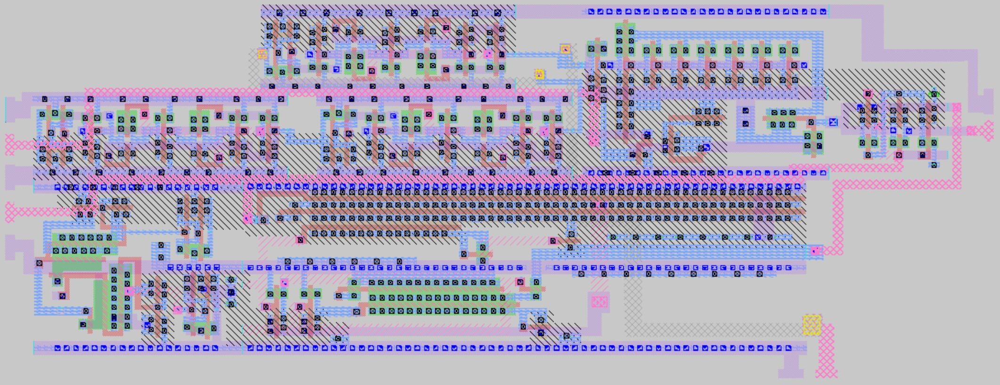
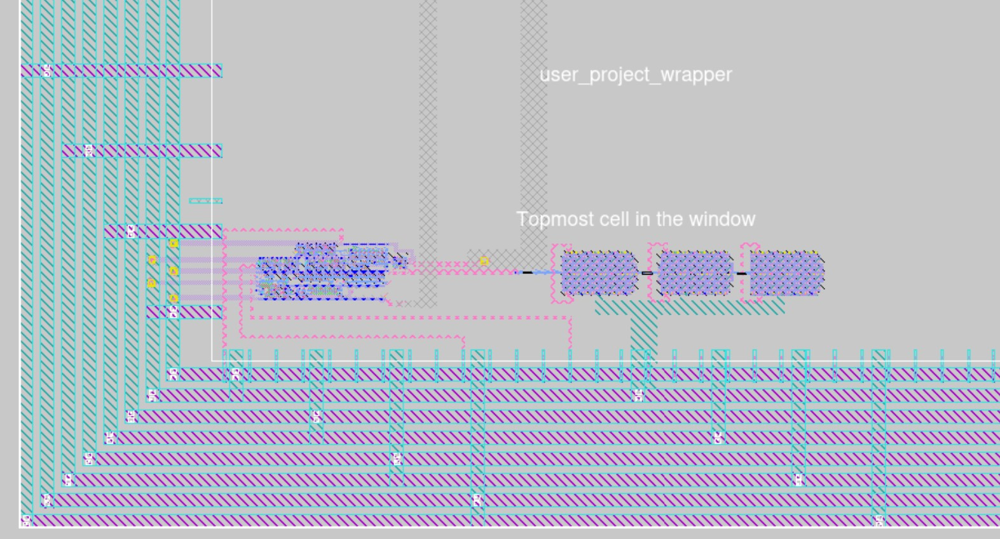
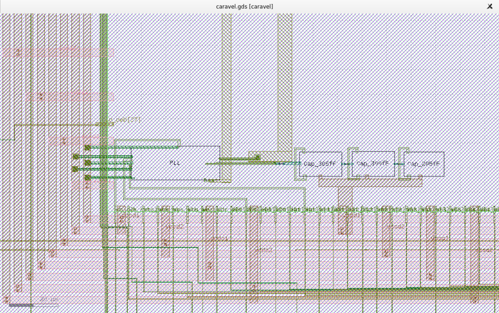
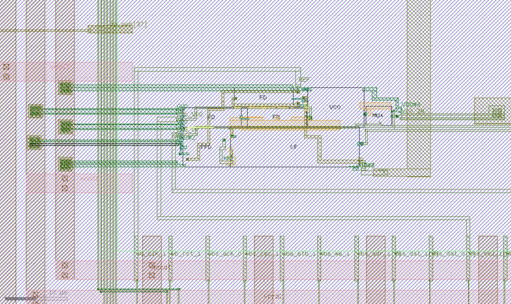
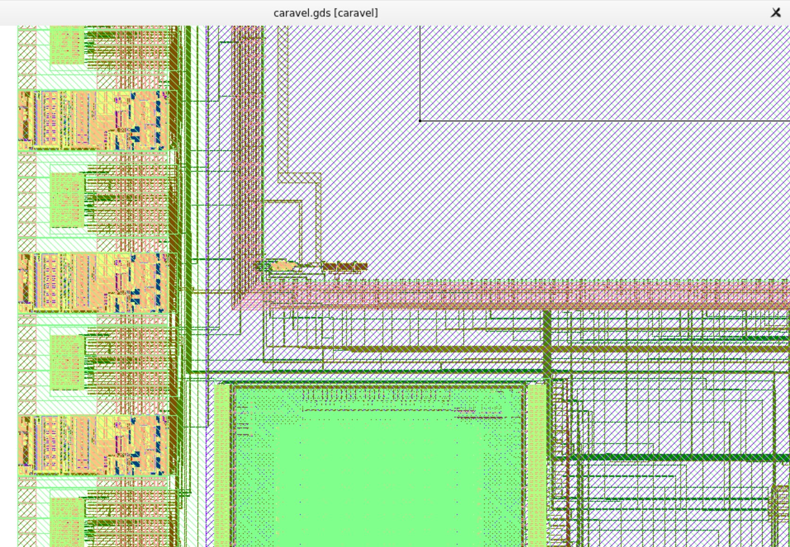
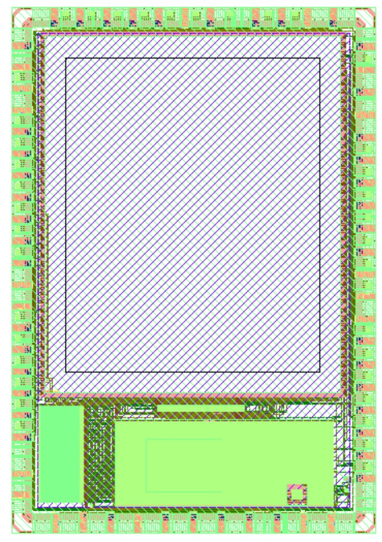

# PLL 8x Clock Multiplier IP

<h4> PLL Repo -> https://github.com/lakshmi-sathi/avsdpll_1v8 </h4>
<h4> The Caravel with PLL integrated -> gds/caravel.gds.gz </h4>  
<h4> The "user_project_wrapper" containing PLL IP -> gds/user_project_wrapper.gds.gz</h4> 

<h3> PLL Pin Connections </h3>
 
 | PLL Pin | Description | Wrapper Pin |
 | --- | --- | --- |
 | REF | Input Clock | wb_clk_i |
 | ENb_VCO | VCO Enable' | wb_sel_i[[0]] |
 | ENb_CP | CP Enable', PLL/VCO Mode Select | wb_sel_i[1] |
 | VDD | Power Supply | VCCD1 |
 | GND | Ground | VSSD1 |
 | VCO_IN | VCO Direct Input | analog_io[30] |
 | CLK | Clock Output | io_out[37] |

<h3> Method Followed: </h3>

* PLL is separately layed-out in Magic (.mag) using tech-file [sky130.tech](https://github.com/lakshmi-sathi/avsdpll1v8_caravel/blob/master/sky130.tech)


* Forked and cloned [Efabless Caravel Git Repo](https://github.com/efabless/caravel)

* In the repo local root directory: <br>
`make uncompress` <br>
`export PDK_ROOT=<location_of_choice>` <br>
`make pdk` <br>

* "user_project_wrapper_empty" GDS is opened in Magic and PLL cell instance is added to it 

* PLL pins are routed mannually to the wrapper pins (as per the connectivity in the above table)

* This completed wrapper (.GDS) is integrated into the Caravel SoC by running `make` in the repo local root directory 


<h3> PLL in User Project Wrapper </h3>


-> PLL on the left and on the right the loop filter

<h3> PLL in Caravel </h3>






<h4> PLL integrated Caravel SoC </h4>




 
# CIIC Harness  

A template SoC for Google SKY130 free shuttles. It is still WIP. The current SoC architecture is given below.

<p align=”center”>
 
</p>

## Getting Started:

Start by cloning the repo and uncompressing the files.
```bash
git clone https://github.com/efabless/caravel.git
cd caravel
make uncompress
```

Then you need to install the open_pdks prerequisite:
 - [Magic VLSI Layout Tool](http://opencircuitdesign.com/magic/index.html) is needed to run open_pdks -- version >= 8.3.60*

 > \* Note: You can avoid the need for the magic prerequisite by using the openlane docker to do the installation step in open_pdks. This [file](https://github.com/efabless/openlane/blob/develop/travisCI/travisBuild.sh) shows how.

Install the required version of the PDK by running the following commands:

```bash
export PDK_ROOT=<The place where you want to install the pdk>
make pdk
```

Then, you can learn more about the caravel chip by watching these video:
- Caravel User Project Features -- https://youtu.be/zJhnmilXGPo
- Aboard Caravel -- How to put your design on Caravel? -- https://youtu.be/9QV8SDelURk
- Things to Clarify About Caravel -- What versions to use with Caravel? -- https://youtu.be/-LZ522mxXMw

## Aboard Caravel:

Your area is the full user_project_wrapper, so feel free to add your project there or create a differnt macro and harden it seperately then insert it into the user_project_wrapper. For example, if your design is analog or you're using a different tool other than OpenLANE.

If you will use OpenLANE to harden your design, go through the instructions in this [README.md][0].

Then, you will need to put your design aboard the Caravel chip. Make sure you have the following:

- [Magic VLSI Layout Tool](http://opencircuitdesign.com/magic/index.html) installed on your machine. We may provide a Dockerized version later.\*
- You have your user_project_wrapper.gds under `./gds/` in the Caravel directory.

 > \* **Note:** You can avoid the need for the magic prerequisite by using the openlane docker to run the make step. This [section](#running-make-using-openlane's-magic) shows how.

Run the following command:

```bash
export PDK_ROOT=<The place where the installed pdk resides. The same PDK_ROOT used in the pdk installation step>
make
```

This should merge the GDSes using magic and you'll end up with your version of `./gds/caravel.gds`. You should expect hundred of thousands of magic DRC violations with the current "development" state of caravel.

## Running Make using OpenLANE's Magic

To use the magic installed inside Openlane to complete the final GDS streaming out step, export the following:

```bash
export PDK_ROOT=<The location where the pdk is installed>
export OPENLANE_ROOT=<the absolute path to the openlane directory cloned or to be cloned>
export IMAGE_NAME=<the openlane image name installed on your machine. Preferably openlane:rc5>
export CARAVEL_PATH=$(pwd)
```

Then, mount the docker:

```bash
docker run -it -v $CARAVEL_PATH:$CARAVEL_PATH -v $OPENLANE_ROOT:/openLANE_flow -v $PDK_ROOT:$PDK_ROOT -e CARAVEL_PATH=$CARAVEL_PATH -e PDK_ROOT=$PDK_ROOT -u $(id -u $USER):$(id -g $USER) $IMAGE_NAME
```

Finally, once inside the docker run the following commands:
```bash
cd $CARAVEL_PATH
make
exit
```

This should merge the GDSes using magic and you'll end up with your version of `./gds/caravel.gds`. You should expect hundred of thousands of magic DRC violations with the current "development" state of caravel.

## Managment SoC
The managment SoC runs firmware that can be used to:
- Configure User Project I/O pads
- Observe and control User Project signals (through on-chip logic analyzer probes)
- Control the User Project power supply

The memory map of the management SoC can be found [here](verilog/rtl/README)

## User Project Area
This is the user space. It has limited silicon area (TBD, about 3.1mm x 3.8mm) as well as a fixed number of I/O pads (37) and power pads (10).  See [the Caravel  premliminary datasheet](doc/caravel_datasheet.pdf) for details.
The repository contains a [sample user project](/verilog/rtl/user_proj_example.v) that contains a binary 32-bit up counter.  </br>

<p align=”center”>

</p>

The firmware running on the Management Area SoC, configures the I/O pads used by the counter and uses the logic probes to observe/control the counter. Three firmware examples are provided:
1. Configure the User Project I/O pads as o/p. Observe the counter value in the testbench: [IO_Ports Test](verilog/dv/caravel/user_proj_example/io_ports).
2. Configure the User Project I/O pads as o/p. Use the Chip LA to load the counter and observe the o/p till it reaches 500: [LA_Test1](verilog/dv/caravel/user_proj_example/la_test1).
3. Configure the User Project I/O pads as o/p. Use the Chip LA to control the clock source and reset signals and observe the counter value for five clock cylcles:  [LA_Test2](verilog/dv/caravel/user_proj_example/la_test2).

[0]: openlane/README.md
